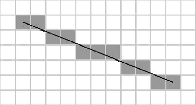
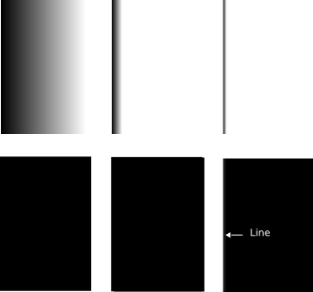
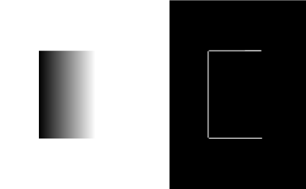
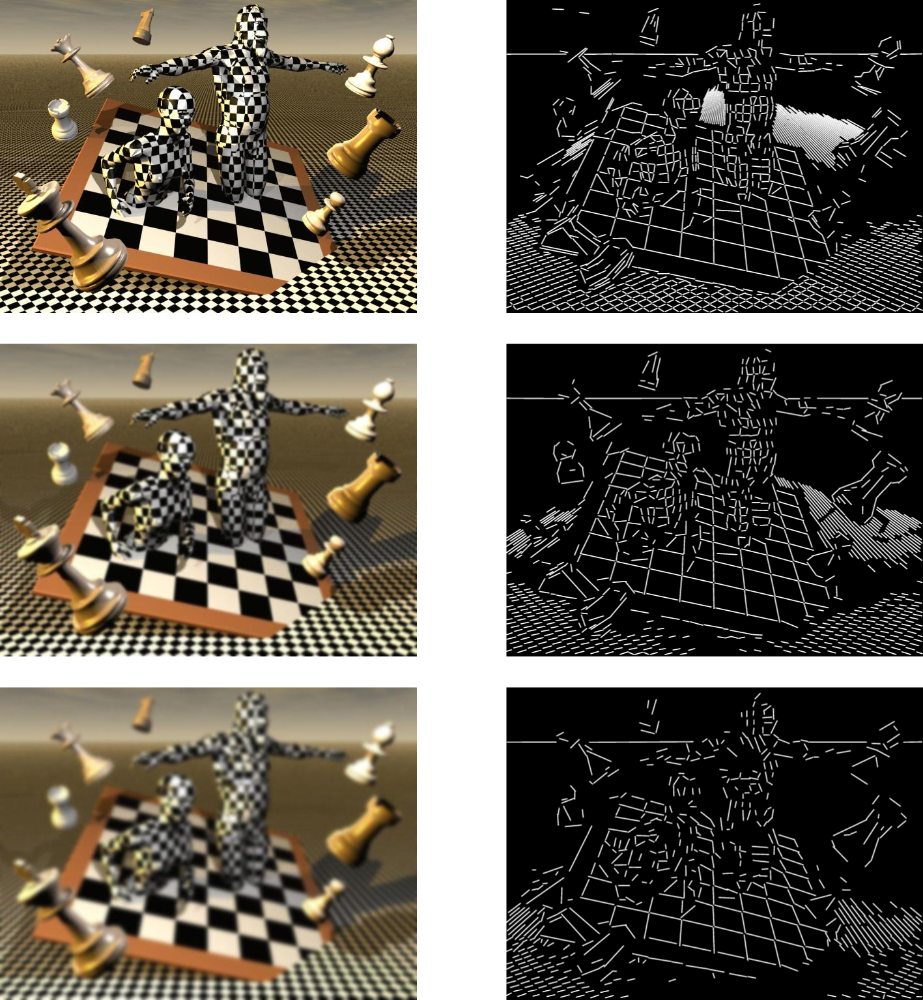
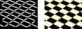

================================================================================
Line Segment Detector
================================================================================

Edge detection's purpose is to detect discontinuities, or sharp hanges in
image brightness, in order to extract information from an image:
discontinuitis in depth, changes in material properties etc. Straight line
detection is a field of edge detection: most algorithms are based on more
general edge detection algorithms: a canny edge detection can be followed by a
Hough Transform to extract straight lines, or particular shapes of an image.

Line Segment Detector
================================================================================

Edges in a natural image are not at all ideal step edges: they are affected by
blurs, shadows etc. Edges are usually detected by measuring the intensity
changes between two or more pixel. Yet, setting a threshold on how large the
intensity change between two neighbouring pixels is an ill posed problem, and
may change with context, or illumination.

Line Segment Detector (LSD) is an algorithm that uses the a contrario model to
validate the existence of a segment in an image.

 The first step is to compute the level-line field. All pixels having the same
level-line angle are clustered. Each cluster of pointis is then subjected to a
validation procedure called a contrario, ensuring that the regions are not
likely to be obtained "by chance". Indeed, no detection of segments should
occur.

The algorithm
================================================================================

The algorithm can be described in several steps.

1. The image is scaled using a Gaussian sub sampling. This allows the
  algorithm to avoid the stair case effect
  This has the effect of blurring images. One could ask himself whether this has
  a negative impact on the line segment detection.

  The staircase effect

2. The level-line field is computed. A transition between black to white and
  white to black will have a 180° rectangle difference.

3. Pixels are selected as used or not used depending on the norm of the
  gradient.

4. Region are formed of pixels with the same gradient.

5. The rectangle bounding boxes of the region are computed.

6. If the rectangles don't have enough pixels density, split them into smaller
  chunks of higher density.

7. Calculate the NFA of each rectange, and threshold the selected rectangles.

Examples and discussion
================================================================================

LSD performs really well on natural images, and quite well on most synthetised
images.

  Examples of several images where the gradient is to slow to be selected.

I thought the algorithm may have some problems dealing with colour gradients.
As expected, LSD detects a segment only on a very steep gradient (the
algorithm detects a segment only for the last image).

  Testing LSD on a box filled with colour gradient. One's perception will
  allow him to perceive a box (ie, add a segment to close the rectangle)

Considering problems with detecting gradients of colour, I imagined LSD would
perform less and less accurately on a blurred image. I tried detected segments
on an image more and more blurred.

  LSD ran on a more and more blurred image

The algorithm works once again surprisingly well. When the image is blurred,
it detects less segments, but is still able to detect most of them.

We can observe on that image that the detects line where there is actually a
part of the chess board.

  LSD detects different segments from white to black and black to white.

