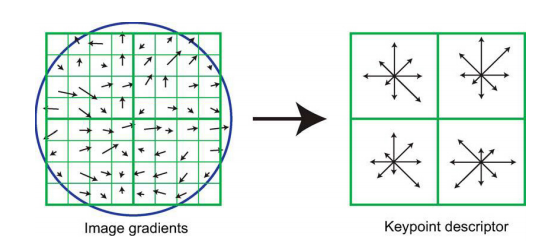

================================================================================
On the consistency of the SIFT Method
================================================================================

Object recognition or image matching algorithms are based on the extraction of
local descriptors on some interest points. The descriptors have to be
invariant to viewpoints changes (rotation, translation and scale of the
patch studied), illumination, noise etc.

One popular method to extract those features is the Scale Invariant Feature
Transform (SIFT) algorithm, which is invariant to illumination, rotation and
scale. [1]_ studies the consistency of the SIFT method to scale invariance.

The SIFT method
================================================================================

By blurring and subsampling an image, one can compute an image at different
octave of the scale space. This mimics seeing the image at different zooms.

.. figure:: images/02_SIFT_invariance_boat.png
   :scale: 50 %

   Two images taken from two different view points of a moving boat are
   matched properly despite zooming factor being different throughout the
   image

The SIFT method seeks interest points at different scales. Each key points is
associated to a square image, whose side direction is given by the dominant
direction of the gradient. The size of the square is also deducted from the
scale factor used. Histograms are then computed for different samples of the
square image. Hence, the SIFT method yields rotation, translation and zoom
invariant descriptors of an image.

In order to obtain light changes invariance, the descriptors are normalized.

The SIFT method covers 4 parameters of an affine transformation: translation,
rotation and zooms.

The ASIFT method
================================================================================

A fully affine matching algorithm  needs to cover 6 parameters. As mentionned,
the SIFT method only covers 4 of those 6 parameters.

The ASIFT methods starts by simulating all affine transformation possible
caused by a change in the camera position. The simulated images are then
matched using the SIFT method, but uses an improved criterion for wrong match
elimination. Indeed, ASIFT compares many pairs of images, and wrong matches
can be accumulated throughout the matching. The ASIFT method uses the ORSA
method [3]_.

Examples and discussion
================================================================================

Figure 2.1 shows how well the SIFT descriptors perform on scale changes.

.. figure:: images/02_strong_light_changes.png
    :scale: 50 %

    Strong light changes

On the other hand, figure 2.2 demonstrate that SIFT can be disappointing on
images with strong light changes.

.. figure:: images/02_sift_breteuil.png
  :scale: 60 %

  First step of a panorama stitching on blurred images.

When matching images of figure 2.3, I obtained 664 matches with ASIFT (1 wrong
match), and 72 matches using SIFT. It demonstrates the ASIFT works much better
than normal SIFT, even for images that have little affine transformation
(a small rotation, and translation). Yet, it is much slower than normal SIFT,
and it seems to me unlikely to be used in tasks such as object retrieval on
important image databases.

.. [1] J-M Morel, G Yu, "Is SIFT scale invariant?"

.. [2] D.G Lowe. "Distinctive image features from scale-invariant key points".
  International Journal of Computer Vision, 60(2):91{110, 2004.

.. [3] K. Mikolajczyk, and C. Schmid. "An affine invariant interest point
   detector." In Proc. European Conf. Computer Vision, Vol. 2350, pp. 128-142
   (2002).

