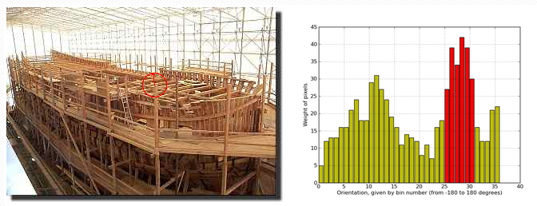

================================================================================
A contrario matching of SIFT like descriptors
================================================================================

Local representations is widely used abroad many vision task: image
registration, panorama stitching, object detection... It performs more
robustely than global approaches, in cases of partial occlusion, changes of
point of view, changes of illumination, multiple occurences etc.

Numerous vision tasks therefore need the same processing chain: extract
descriptors, compare them, match them, group them. We focus here on the
matching step.

A contrario matching
================================================================================

After detecting interest points, and computing the histogram, the main
orientation of a key points is estimated by looking at the statistical
distribution of the gradient orientation. Lowe's method is built on quantizing
the gradient orientation, and the peaks are defined by local maxima. Local
maxima are thresholded at 80% of the global maximum. The location of each peak
is then refined.

The A Contrario matching uses the Helmholtz principle: "no structure should
be detected in a noise image" (already used in the LSD algorithm) to detect
meaningful intervals, ie, interval containing more samples than the expected
value. It uses the null hypothesis, a histogram built from random samples, in
order to set the :math:\epsilon - meaningful interval. Yet, meaningful
interval can contain gaps. Hence, we define a meaningful-gap and
meaningful-modes. A meaningful gap is an interval that contains less samples
than expected. A meaningful mode is a meaningful interval that doesn't contain
any meaningful gap.

   Example

Examples and discussion
================================================================================

   Significant differences between the Lowe's method, and the a contrario
   method. The second detects only one orientation, while the Lowe's method
   spots 4.

All the example shows that the A contrario method is more robust to peaks in a
small neighbourhood.

  A contrario matching

  Lowe's method

[1]_ "A contrario matching of SIFT-like descriptors" Julien Rabin, Julie
Delon, Yann Goussea & Jean-Michel Morel

