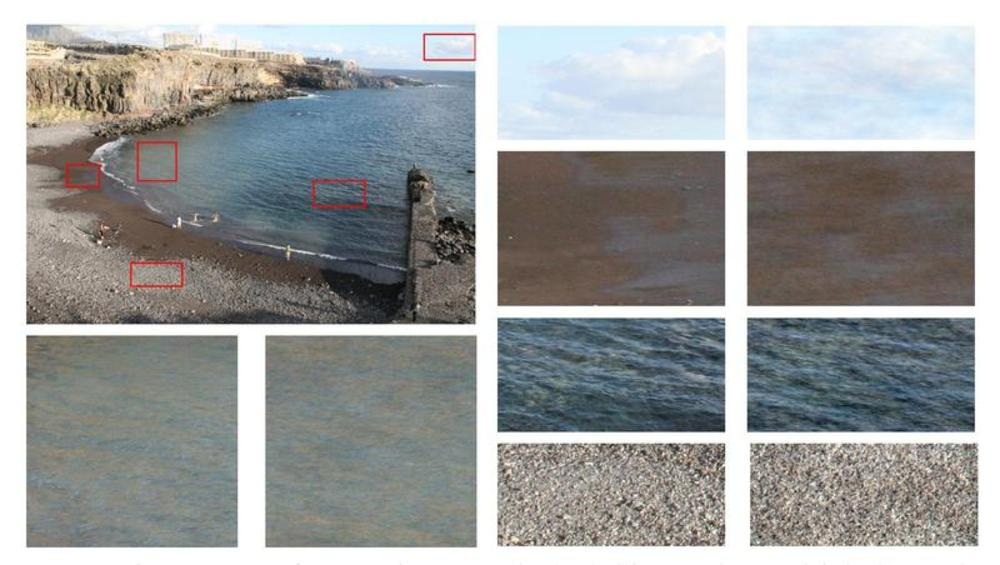

================================================================================
Image texture synthesis using spot noise and phase randomization
================================================================================

Texture synthesis is the process of constructing a large image from a sample
image looking similar, but being pixel-wise different.

Random Phase Noise (RPN)
================================================================================

Textures fall into two categories: micro textures, and macro textures
(geometric patterns, strong edges etc...). Experiments [1]_ have shown that
geometric contours are contained mostly in the phase of the DFT of an image,
and the texture in the modulus of such decomposition. By replacing the Fourier
phase by a random one, one could keep the texture of an image, and yet change
the geometric structure of that image, therefore obtaining a new but similar
texture.

Testing and discussion
================================================================================

RPN is an extremely fast texture synthesis algorithm (2 FFT), visually stable
which reproduces well micro textures.

  
  Examples obtained using RPN on a natural images

Unfortunately, the algorithm is not robust to non stationarities: it does not
work for macro textures, which have a strong geometry. Yet, macro textured
objects can be seen as a micro texture from a critical distance.

.. [1] B Galerne, Y Gousseau, J-M Morel. "Micro-Texture Synthesis by
  Phase Randomization", *Image Processing On Line**, 2011.
  uOI:10.5201/ipol.2011.ggm_rpn

.. [2] X Tang, W K Stewart, "Optical and sonar image classification: wavelet
  packet transform vs Fourier Transform," *Comput. Vis. Image Underst.,* vol.
  79, no 1, pp 25-46, July 2000
