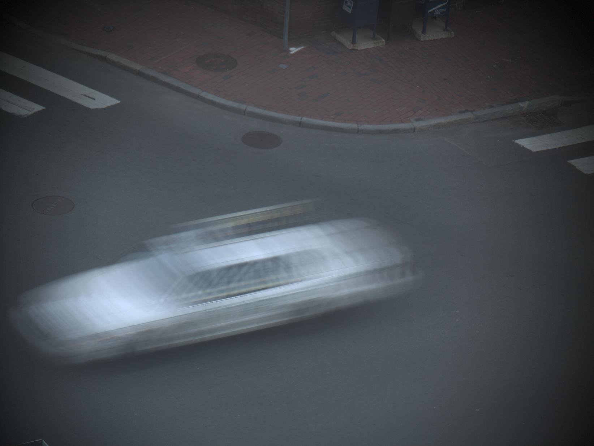
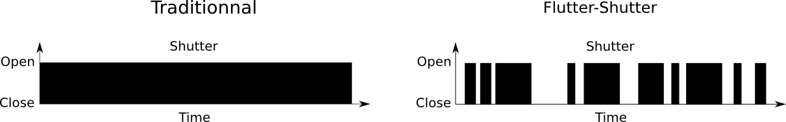

================================================================================
The flutter shutter paradox
================================================================================

In a single exposure photograph, moving objects or moving camera causes motion
blur. The object is convolved by a temporal box filter, that destroys the
important details of an image.

  Single photo (exposition time 200m)

Flutter Shutter
================================================================================

Instead of leaving the shutter open for the whole image acquisition,
flutters-shutter is a method that opens and closes the shutter, for chosen
exposure time, guaranteeing invertibility.

This technique allows to use much longer exposure time, therefore better SNR.
[1]_ demonstrates that the SNR increase is in fact limited.

The main idea behind flutter shutter is to transform an ill posed invertible
problem into a well posed invertible problem. A blur can be modelised by
convoluting the Fourier transform with a fixed window shaped kernel. This is
invertible as soon as the first zero of the transform is in the support of the
image. If the first zero is outside of the support of :math:`u`, the motion
blur is then considered as negligible, and the problem becomes well posed.

[1]_ shows that the motion blur is negligible when using a time-exposure of
:math:`\Delta{t} = 1.0909 / |v|`.

Flutter-shutter is a multi image acquisition system, resulting in a linear
combination of  N images. Each image is taken with an exposure time smaller
than :math:`\Delta{t}`, hence having an elementary blur negligible.

Example and discussion
================================================================================

.. [1] Y Tendero, J-M Morel, N Rougé, "The Flutter Shutter Paradox"
