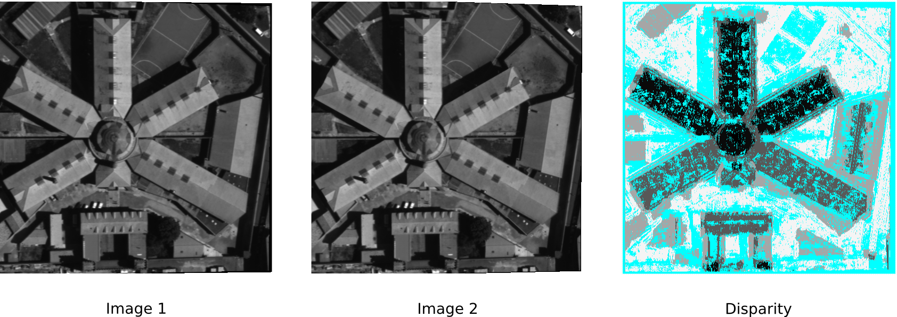

================================================================================
A contrario block matching in stereo
================================================================================

The stereo pipeline aims at building the 3D geometry of a surface using a
succession of algorithms, in the goal of building a disparity map. As in
panorama stitching, or object recognition, finding correspondences between
images is the first, and probably most important step of the algorithm
pipeline. This presentation describes two methods used for the matching step:
the a contrario block matching algorithm and the auto similarity (or self
similarity) method.

Local descriptors are extracted for patches around each interest points of the
two (or more) images. A similarity (or distance) is then computed between all
the patches.

A contrario block matching
================================================================================

The a contrario methods uses a decision model based on the probability of two
patches from two images being similar just by chance. Calculating this
probability on just random patches doesn't reflect the statistics of a natural
images, which leads to either many false matches or a very sparse detection of
matches. In order to extract patches that reflect the natural image, and the
independence between patches, the PCA is used to compute 9*9 decorrelated
patches.

It appears that the first patch contains the most information. Intuitively, if
two patches are not similar on the first component, the match needs to be
rejected, even if the following components have good similarities.

Self similarity method
================================================================================

The a contrario model sets a global threshold to accept patches, independent
from the rest of the matches. Most images contains repeated patterns, like
windows or doors: the a contrario model does not learn those repetition,
which leads to numerous wrong patches. As proposed by Lowe [1]_,
another threshold can be set using the ratio between the distance of the
nearest neighbor and the second nearest neighbor.

.. [1] "Object recognition from local scale-invariant features" Lowe, David C
   (1999)

Examples and discussion
================================================================================

Unfortunately, the demo computes the whole stereo pipeline, and not only the
matches. It makes it hard to visualize exactly which matches are correct or
wrong.

As mentioned in [2]_, one of the major problems using these methods is the
adhesion effect. The matching being done on a neighborhood and not a single
pixel, there is overlap between the real disparity and the disparity computed.
This leads to a dilatation of the disparity map.

Reflexion can lead to errors in the computation of the disparity. Calculating
the disparity on images taken in a mirror will not compute the distance to the
mirror, but to the reflexion in the mirror.

   We can see on this image the dilatation due to the adhesion image, on the
   side of the building.

.. [2] Binocular stereo pipeline: Andres Almansa, Neus Sabater, Pascal Monasse,
  Jean-Michel Morel

